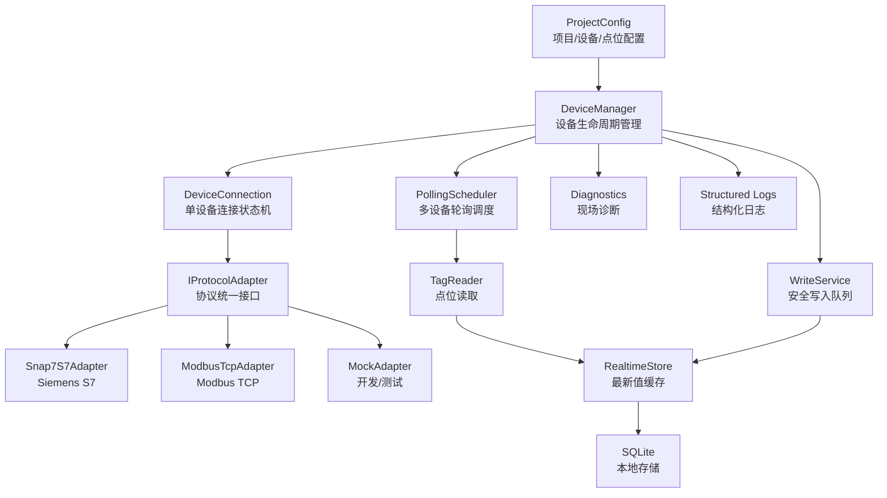
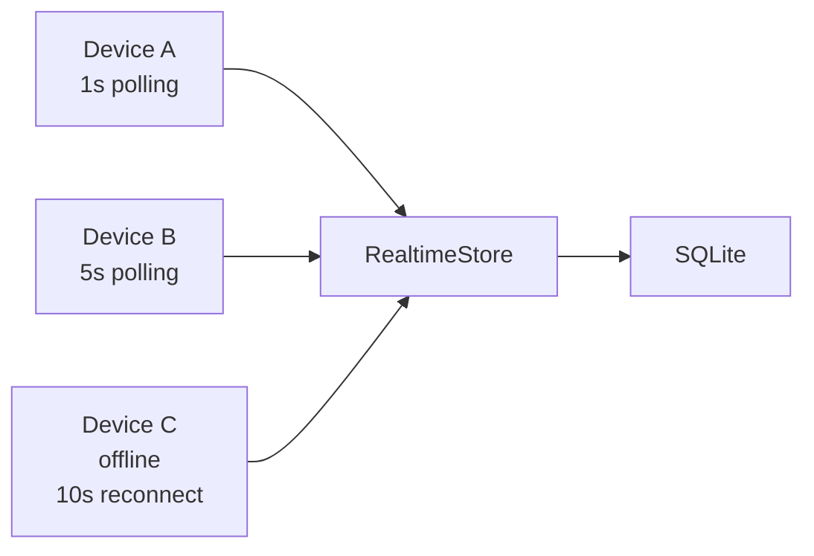
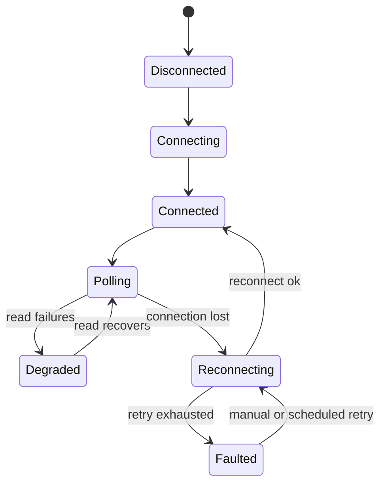

# DeviceGateway 升级重构技术方案

更新时间：2026-05-08

## 1. 文档定位

本文档是 `EnviroEquipmentFinalEdition` 升级重构项目的开发者主方案。

本阶段只讨论核心实现，不讨论最终界面。界面可以以后是 Qt、WPF、Avalonia、Web 或其他形式，但不应该影响设备通信内核的设计。

核心判断：

- 这是升级重构项目，不是旧 Qt 工程的修修补补。
- 第一优先级是把多设备、多协议、点位配置、轮询、诊断、日志这些核心能力做稳。
- 界面只是调用核心能力的外壳，不直接承担 PLC 通信和调度职责。

## 2. 推荐技术栈

| 层级 | 推荐技术 | 说明 |
|---|---|---|
| 主语言 | C# |
| 运行时 | .NET 8 LTS |
| 运行形态 | Console Runner + Windows Service |
| Siemens S7 | 官方 Snap7 native DLL |
| Modbus | Modbus TCP adapter |
| 配置 | JSON 优先，兼容 XML 导入 |
| 本地数据库 | SQLite |
| 日志 | Serilog 或同等级结构化日志 |
| 并发模型 | async/await、Task、Channel |
| 诊断脚本 | PowerShell / bat |
| 部署 | Windows 单机部署，后续安装包 |

当前已经完成的 S7-200 SMART 连接验证仍然作为第一条落地路线：

```text
PLC IP:          192.168.2.180
PC Ethernet IP:  192.168.2.10/24
Port:            102
Snap7:           connection-type=basic, rack=0, slot=0
Readable areas:  V memory and M memory probe tags
```

## 3. 为什么选择 C# / .NET 8 做核心

本项目真正复杂的地方不是界面，而是现场工程能力：

- 多设备同时连接和轮询。
- 不同项目的设备和点位配置。
- S7、Modbus 等多协议统一抽象。
- 网络、端口、协议握手、点位读取四类故障要能区分。
- 断线重连、降频重试、日志追踪和现场诊断。
- 后续可能需要 Windows Service、安装包、远程状态上报。

C# / .NET 8 对这些问题的工程成本更低：

- `async/await` 很适合多设备并发轮询。
- 配置、日志、SQLite、命令行、Windows Service 生态成熟。
- 代码边界比 C++ 插件 ABI 更容易维护。
- 现场开发人员更容易写诊断工具和自动化检查。
- 后续对接界面或本地 API 更自然。

## 4. 目标架构



架构原则：

- 设备通信内核独立，不依赖任何 UI。
- 上层只面对统一的设备、点位、读写结果模型。
- S7、Modbus 是插件式协议适配器，不把协议细节泄漏到业务层。
- 读取和写入分离；写入必须经过校验和审计。
- 诊断能力是核心功能，不是临时脚本。

## 5. 推荐工程结构

```text
src/
  DeviceGateway.Core/
    Models/
    Config/
    Devices/
    Scheduling/
    Diagnostics/
    Logging/

  DeviceGateway.Protocols/
    IProtocolAdapter.cs
    ProtocolAdapterFactory.cs
    ProtocolCapabilities.cs

  DeviceGateway.Protocols.Snap7/
    Snap7S7Adapter.cs
    S7AddressParser.cs
    Snap7NativeLibrary.cs

  DeviceGateway.Protocols.Modbus/
    ModbusTcpAdapter.cs
    ModbusAddressParser.cs

  DeviceGateway.Storage/
    SqliteStore.cs
    Migrations/
    RealtimeStore.cs

  DeviceGateway.App/
    Program.cs
    Commands/
    ServiceHost/

tests/
  DeviceGateway.Core.Tests/
  DeviceGateway.Protocols.Tests/
  DeviceGateway.IntegrationTests/

docs/
  DEVICE_GATEWAY_REFACTOR_PLAN.md
  PLC_S7_200_SMART_EXECUTION_REPORT.md
  SNAP7_INTEGRATION.md
```

当前 `src\SiemensS7Demo` 可以继续作为连接验证原型，后续逐步迁移为上述结构。

## 6. 核心模型

### 6.1 ProjectConfig

项目配置描述一个项目有哪些设备、每台设备的协议参数和点位表。

建议配置形态：

```json
{
  "projectId": "env-box-demo",
  "projectName": "环境试验箱项目",
  "devices": [
    {
      "id": "box-001",
      "name": "1号试验箱",
      "protocol": "s7",
      "ip": "192.168.2.180",
      "port": 102,
      "enabled": true,
      "s7": {
        "connectionType": "basic",
        "rack": 0,
        "slot": 0
      },
      "polling": {
        "intervalMs": 1000,
        "failureBackoffMs": 10000
      },
      "tags": [
        {
          "id": "temperature-pv",
          "name": "TemperaturePV",
          "displayName": "当前温度",
          "address": "VW100",
          "dataType": "Int16",
          "scale": 0.1,
          "unit": "degC",
          "access": "read"
        }
      ]
    }
  ]
}
```

注意：新项目建议 JSON；旧 XML 点位表可以通过导入工具转换，不作为新核心的唯一配置格式。

### 6.2 DeviceDefinition

设备定义负责描述设备静态信息：

```text
id
name
protocol
ip
port
protocol-specific options
polling policy
tags
enabled
```

### 6.3 TagDefinition

点位定义负责描述 PLC 地址和数据解释方式：

```text
id
name
displayName
address
dataType
scale
offset
unit
access: read / write / readwrite
group
pollingIntervalMs
```

### 6.4 TagValue

实时值必须带质量和时间戳，不只存一个值：

```text
deviceId
tagId
value
rawValue
quality: Good / Bad / Uncertain
timestamp
errorCode
errorMessage
```

## 7. 协议适配器设计

核心接口建议：

```csharp
public interface IProtocolAdapter
{
    string ProtocolName { get; }
    DeviceConnectionState State { get; }

    Task ConnectAsync(DeviceDefinition device, CancellationToken ct);
    Task DisconnectAsync(CancellationToken ct);

    Task<TagReadResult> ReadAsync(TagDefinition tag, CancellationToken ct);
    Task<TagWriteResult> WriteAsync(TagDefinition tag, object value, CancellationToken ct);

    Task<ProtocolDiagnosticResult> DiagnoseAsync(DeviceDefinition device, CancellationToken ct);
}
```

适配器边界：

- `Snap7S7Adapter` 只负责 Snap7 连接、地址解析、读写、错误映射。
- `ModbusTcpAdapter` 只负责 Modbus 功能码、寄存器/线圈地址解析、读写。
- `DeviceManager` 不应该知道 Snap7 的 rack/slot 计算细节。
- `PollingScheduler` 不应该知道协议细节。

## 8. 多设备调度

多设备场景下，不能用一个全局循环拖着所有设备跑。推荐：

- 每台设备一个独立连接状态机。
- 每台设备一个或多个轮询任务。
- 慢设备或故障设备不能阻塞其他设备。
- 失败后按设备降频重试。
- 轮询结果统一进入 `RealtimeStore`。



调度要求：

- 支持启动、暂停、恢复、停止单台设备。
- 支持不同点位不同周期。
- 支持连接失败、读取失败、协议异常分别计数。
- 支持取消令牌，程序退出时能释放连接。

## 9. 连接状态机

每台设备建议维护明确状态：

```text
Disabled
Disconnected
Connecting
Connected
Polling
Degraded
Reconnecting
Faulted
```

典型流转：



## 10. 写入策略

写入必须独立成服务，不允许界面或业务代码绕过统一入口直接写 PLC。

写入流程：

1. 检查设备是否在线。
2. 检查点位是否允许写入。
3. 校验数据类型、范围、单位和枚举值。
4. 记录写入请求。
5. 执行协议写入。
6. 必要时读回确认。
7. 写入结果入库和日志。

写入点位默认关闭，必须显式配置：

```json
{
  "id": "run-command",
  "name": "RunCommand",
  "address": "M10.0",
  "dataType": "Bool",
  "access": "write",
  "writePolicy": {
    "requiresConfirm": true,
    "readback": true
  }
}
```

## 11. 诊断能力

诊断是本项目的核心能力之一。现场问题必须能快速定位到哪一层：

| 层级 | 典型问题 | 诊断方式 |
|---|---|---|
| 网卡 | 没有物理 IP、走了 VPN/TAP | 输出 InterfaceAlias 和 SourceAddress |
| TCP | 端口 102/502 不通 | TCP connect test |
| 协议握手 | Snap7 rack/slot/connectionType 错误 | connect-only |
| 点位 | 地址、类型、权限错误 | read-once |
| 调度 | 某设备慢或离线 | per-device state |

建议命令：

```powershell
.\DeviceGateway.App.exe check-prereqs
.\DeviceGateway.App.exe diagnose --device box-001
.\DeviceGateway.App.exe connect-test --device box-001
.\DeviceGateway.App.exe read-once --device box-001 --tag temperature-pv
.\DeviceGateway.App.exe run --project .\configs\env-box-demo.json
```

当前已有脚本可以作为诊断原型：

```text
tools\check-prereqs.ps1
tools\test-plc-network.ps1
tools\connect-plc.ps1
tools\run-s7-demo.ps1
```

## 12. 本地存储

第一阶段推荐 SQLite，理由：

- 单机部署简单。
- 不需要数据库服务。
- 适合设备、点位、最新值、事件、少量历史数据。
- 后续可以同步到服务器或云端。

建议表：

```text
projects
devices
tags
tag_latest
tag_history
write_commands
device_events
diagnostic_runs
system_logs
```

历史数据如果量很大，可以先控制采样写入策略：

- 最新值全部保存到 `tag_latest`。
- 历史值按变化、周期或关键点保存到 `tag_history`。
- 高频曲线以后再考虑专门时序库。

## 13. 日志规范

日志必须结构化，不能只写自然语言字符串。

关键字段：

```text
timestamp
level
eventId
projectId
deviceId
tagId
protocol
ip
port
operation
durationMs
result
errorCode
errorMessage
```

典型事件：

```text
DeviceConnectStarted
DeviceConnectSucceeded
DeviceConnectFailed
DeviceDisconnected
TagReadSucceeded
TagReadFailed
TagWriteRequested
TagWriteSucceeded
TagWriteFailed
RouteRiskDetected
DiagnosticCompleted
```

## 14. 实施阶段

### 阶段 0：保留当前连接验证能力

状态：已完成。

当前已有：

- S7-200 SMART 真实连接成功。
- 官方 Snap7 DLL 接入。
- 连接优先脚本。
- 网络路由诊断。
- 设备信息读取命令 `--device-info`。
- S7-200 SMART V 区地址解析和默认只读探测配置。
- 单次读取命令 `--read-once`，可逐点返回 GOOD/BAD。
- 能力清单命令 `--capabilities`。
- 配置校验命令 `--validate-config`。
- 本地安全自测命令 `--self-test`，覆盖默认 S7 XML、项目 JSON、mock 写入保护和 Modbus loopback 读写。
- 有限轮询命令 `--cycles`，便于自动化验收，不需要人工回车停止。
- 项目 JSON 样例 `src\SiemensS7Demo\Config\project.sample.json`，当前可顺序连接并读取 S7-200 SMART 样例点。
- 写入保护：必须同时满足命令行 `--allow-write` 和点位 `safeWrite=true`，数值点支持 `min` / `max` 范围校验，`ReadWrite` 点位写后读回。
- Modbus TCP 适配器原型已接入，支持 C/DI/HR/IR 地址；本地 loopback 读写已通过，真实 Modbus 设备仍待现场验证。

### 阶段 1：DeviceGateway 核心骨架

目标：

- 建立新工程结构。
- 定义配置模型、设备模型、点位模型、读写结果模型。
- 实现 `IProtocolAdapter`。
- 把当前 Snap7 原型迁移到 `DeviceGateway.Protocols.Snap7`。

验收：

- 能用 JSON 配置连接 `192.168.2.180`。
- 能运行 connect-only。
- 错误信息可区分网络、TCP、Snap7、配置错误。

### 阶段 2：点位读取和轮询

目标：

- 实现 S7 地址解析。
- 实现只读点位单次读取。
- 实现多设备轮询调度。
- 建立 `RealtimeStore`。

验收：

- 至少一个真实 S7-200 SMART 点位读数正确。
- 两台设备并发轮询时互不阻塞。
- 断线后状态进入 Reconnecting，恢复后继续读。

### 阶段 3：Modbus TCP

目标：

- 完成并现场验证 Modbus TCP adapter。
- 支持线圈、离散输入、保持寄存器、输入寄存器。
- 支持常见数据类型和字节序配置。

验收：

- 能连接一个真实或模拟 Modbus TCP 设备。
- 能和 S7 设备同时轮询。

当前状态：代码层面已接入 `ModbusTcpAdapter` 和 `--adapter modbus`，但还没有真实 Modbus 设备实测，因此不能把字节序、寄存器映射和设备兼容性视为已验收。

### 阶段 4：安全写入

目标：

- 在当前原型基础上完善生产级 `WriteService`。
- 保留命令行 `--allow-write` 和点位 `safeWrite=true` 双保险。
- 实现写入权限、类型、范围校验、日志和读回确认。

验收：

- 一个明确安全的测试点位可写入并读回。
- 未配置为可写的点位拒绝写入。

当前状态：原型已经能拒绝未授权写入；还没有执行现场真实写入，因为团队尚未确认不会触发设备动作的安全测试点。

### 阶段 5：服务化和交付

目标：

- 支持 Windows Service。
- 支持命令行诊断。
- 支持一键安装和配置模板。
- 输出运行日志和诊断报告。

验收：

- 重启电脑后服务可自动启动。
- 现场人员可用命令生成诊断结果。

## 15. 开发约定

- 先写通信内核，不写界面依赖。
- 所有协议都必须通过 `IProtocolAdapter`。
- 读取和写入必须走统一服务。
- 所有连接失败必须带明确层级：route、tcp、protocol、tag、config。
- 每个设备的状态必须可查询。
- 点位配置必须可校验，启动时发现错误要提前报出。
- 第一批真实点位只读验证通过前，不做写入。
- 新代码优先写自动化测试，硬件相关测试用 integration test 标记。

## 16. 当前开发者入口

现场 S7 连接报告：

```text
docs\PLC_S7_200_SMART_EXECUTION_REPORT.md
```

Snap7 接入说明：

```text
docs\SNAP7_INTEGRATION.md
```

当前可运行命令：

```powershell
.\tools\connect-plc.ps1
.\tools\run-s7-demo.ps1 --adapter snap7 --connect-only
.\tools\check-prereqs.ps1
```


