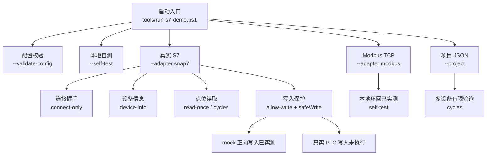

# 设备操作能力矩阵

更新时间：2026-05-08

本文档记录当前 `SiemensS7Demo` 已经实现、已经实测、尚未现场验收和下一步不能直接承诺的操作能力。

## 1. 当前总览



## 2. 操作能力表

| 操作 | 命令 / 入口 | 当前状态 | 本轮实测结果 |
|---|---|---|---|
| 前置条件检查 | `tools\check-prereqs.ps1` | 已实现，已实测 | 通过；本机无 .NET SDK，但 csc fallback 可用。 |
| PLC 网络检查 | `tools\test-plc-network.ps1 -Ip 192.168.2.180 -Port 102` | 已实现，已实测 | 通过；`InterfaceAlias=以太网`，`SourceAddress=192.168.2.10`。 |
| 配置校验 | `--validate-config` | 已实现，已实测 | 默认 S7 XML 通过；项目 JSON 通过，并提示 Modbus 示例写点被锁定。 |
| 本地自测 | `--self-test` | 已实现，已实测 | S7 XML、项目 JSON、mock 写保护、Modbus loopback 全部 PASS。 |
| S7 连接握手 | `--adapter snap7 --connect-only` | 已实现，已实测 | S7-200 SMART 连接成功。 |
| S7 设备信息 | `--adapter snap7 --device-info` | 部分实现，已实测 | 块数量可读；部分 CPU 详细信息接口返回 Item not available。 |
| S7 单次读取 | `--adapter snap7 --read-once` | 已实现，已实测 | `V0.0`、`VW0`、`VW2`、`VD4`、`VD8`、`M0.0` 均 GOOD。 |
| S7 有限轮询 | `--adapter snap7 --cycles 2 --interval 1` | 已实现，已实测 | 连续 2 轮读取均 GOOD。 |
| 项目 JSON 单次读取 | `--project ... --read-once` | 已实现，已实测 | 当前启用设备 `s7-200-smart-main` 读取成功。 |
| 项目 JSON 有限轮询 | `--project ... --cycles 2` | 已实现，已实测 | 当前启用设备连续 2 轮读取成功。 |
| mock 正向写入 | `--mock --allow-write --write MockWord=123` | 已实现，已实测 | 写入并读回 `MockWord=123`。 |
| 写入开关拦截 | 不带 `--allow-write` | 已实现，已实测 | 命令被拒绝。 |
| 写入范围拦截 | `MockWord=1001`，max 为 `1000` | 已实现，已实测 | 命令被拒绝。 |
| Modbus TCP 读写 | `--self-test` 内置 loopback | 代码已实现，协议级已实测 | 本地 Modbus loopback 读写通过。 |
| 旧业务点位导入 | `tools\import-legacy-config.ps1` | 已实现，已实测 | 旧 S7 冒烟表 30 点真实读取全 GOOD。 |
| 运行日志 | `--run-log <path>` | 已实现，已实测 | JSONL snapshot 已落盘。 |
| BAD 严格失败 | `--fail-on-bad-quality` | 已实现，已实测 | S7 GOOD 时成功；Modbus BAD 时退出码为 1。 |
| 真实 PLC 写入 | 需要真实安全点位 | 保护框架已完成，未执行 | 暂停；缺少现场确认安全写入点。 |
| 真实 Modbus 设备 | 需要真实设备 | 已尝试，未通过 | TCP 502 可连但 Modbus 读点返回连接关闭。 |

## 3. 当前真实 S7 实测摘要

现场目标：

```text
PLC:        S7-200 SMART
IP:         192.168.2.180
Port:       102
PC source:  192.168.2.10
Route:      以太网
Snap7:      connection-type=basic, rack=0, slot=0
```

最新只读结果：

```text
M0.0  GOOD False
V0.0  GOOD False
VW0   GOOD 8 / 8200  该值会变化，当前仍只能当探测点
VW2   GOOD 0
VD4   GOOD 33554433
VD8   GOOD 0
```

设备信息结果：

```text
BlockCounts: OB=1, FB=0, FC=0, DB=1, SFB=0, SFC=0, SDB=2
Unsupported: GetOrderCode, GetCpuInfo, GetCpInfo, GetPlcStatus, GetProtection
```

解释：S7-200 SMART 可以完成连接和读点；部分 Snap7 设备信息接口不被这台 CPU 支持，不能作为连接失败判断。

## 4. 写入安全规则

真实设备写入必须同时满足：

1. 命令行显式加入 `--allow-write`。
2. 点位配置中 `access` 不是 `Read`。
3. 点位配置中 `safeWrite="true"`。
4. 数值点如果配置了 `min` / `max`，写入值必须在范围内。
5. `ReadWrite` 点位写入后会立即读回，读回失败则命令失败。

当前只在 `mock_write_sample.xml` 和 Modbus loopback 中做了写入实测，没有对真实 PLC 执行写入。

## 5. 接下来仍不能直接承诺的事

| 项目 | 原因 | 下一步 |
|---|---|---|
| 真实业务点位都能读 | 当前只有探测点，缺 PLC 点位表。 | 导出或整理 V/M/I/Q/DB 地址、类型、单位、缩放。 |
| 真实设备可安全写入 | 缺不会触发动作的确认点。 | 由现场或 PLC 程序负责人指定安全测试位/寄存器。 |
| Modbus 真实设备兼容 | 只有本地 loopback 验证。 | 接一台真实 Modbus TCP 设备或模拟器，确认字节序和地址偏移。 |
| 长期多设备生产运行 | 当前是命令行 runner，已支持 JSONL 运行日志。 | 继续补设备状态机、重连、降频、SQLite、Windows Service。 |
| 完整设备身份信息 | S7-200 SMART 不支持部分 Snap7 信息接口。 | 以配置和点位读取为主，必要时从 PLC 工程或铭牌补充。 |

## 6. 推荐验收顺序

1. 固定 PLC IP 和电脑网卡。
2. 跑 `check-prereqs` 和 `test-plc-network`。
3. 跑 `connect-only`。
4. 跑 `device-info`。
5. 跑 `validate-config`。
6. 跑 `read-once`。
7. 跑 `cycles 2`。
8. 替换为真实点位表，再重复 5 到 7。
9. 现场确认安全写点后，才允许真实 PLC 写入。
