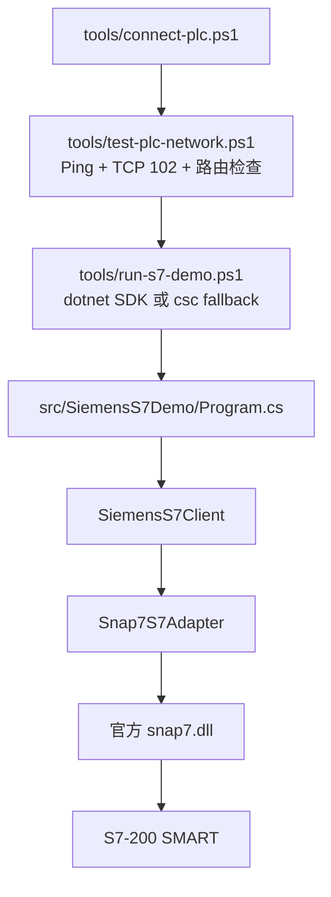

# S7-200 SMART 连接执行报告

更新时间：2026-05-08

## 1. 文档目的

本文档用于给团队统一说明 `EnviroEquipmentFinalEdition` 当前 Siemens S7 通信工作的执行计划、执行情况、当前进展和技术方案。

升级重构的开发者主方案见：

```text
docs\DEVICE_GATEWAY_REFACTOR_PLAN.md
```

当前操作能力矩阵见：

```text
docs\OPERATION_CAPABILITY_MATRIX.md
```

当前项目第一目标：

1. 先证明电脑能通过物理网线连接 PLC。
2. 再证明 Snap7 能完成协议握手。
3. 最后再做真实点位读取、写入和业务集成。

这样可以把问题拆清楚：Windows 路由问题、Snap7 握手问题、PLC 点位地址问题分别处理。

## 2. 当前结论

连接优先目标已经完成，当前接入设备为 S7-200 SMART。

| 项目 | 当前值 |
|---|---|
| PLC 型号 | S7-200 SMART |
| 已验证 PLC IP | `192.168.2.180` |
| 电脑物理网卡 IP | `192.168.2.10/24` |
| PLC 通信端口 | `102` |
| Windows 路由 | 物理网卡 `以太网` |
| Snap7 连接类型 | `basic` |
| Rack / Slot | `rack=0`, `slot=0` |
| Snap7 握手结果 | `Connected` |
| 一键启动脚本 | `tools\connect-plc.bat` |
| 设备信息脚本 | `tools\device-info.bat` |
| 单次读取脚本 | `tools\read-once.bat` |
| 能力清单命令 | `tools\run-s7-demo.ps1 --capabilities` |
| 多设备项目样例 | `src\SiemensS7Demo\Config\project.sample.json` |
| 自测命令 | `tools\run-s7-demo.ps1 --self-test` |
| 有限轮询命令 | `tools\run-s7-demo.ps1 --cycles 2 --interval 1` |

重要修正：

- 之前假设的 `192.168.2.233` 没有通过物理网线连通。
- 现场扫描发现真实在线设备为 `192.168.2.180`。
- `192.168.2.180:102` 通过物理 `以太网` 可达，并且 Snap7 握手成功。
- 当前可读取 S7-200 SMART 的 V 区和 M 区探测点位。

2026-05-08 最新一次现场验证：

```text
Connect: OK
MBit0  address=M0.0 value=False
VBit0  address=V0.0 value=False
VDInt4 address=VD4 value=33554433
VReal8 address=VD8 value=0
VWord0 address=VW0 value=1032
VWord2 address=VW2 value=0
```

## 3. 现场拓扑


这台电脑还有 `LetsTAP`、`NordLynx` 等虚拟网卡，所以判断连接成功时不能只看 TCP 是否通，还要看流量是否真的走物理网卡。

有效网络检查应看到：

```text
TcpTestSucceeded: True
InterfaceAlias: 以太网
SourceAddress: 192.168.2.10
```

## 4. 技术方案

### 4.1 依赖方案

项目使用官方 Snap7 作为 Siemens S7 原生通信库：

```text
https://github.com/davenardella/snap7.git
```

当前项目内置目录：

```text
src\SiemensS7Demo\Native\Snap7\
  win64\snap7.dll
  reference\dotnet\snap7.net.cs
  licenses\lgpl-3.0.txt
```

项目运行时加载当前项目内置的官方 `snap7.dll`。当前阶段只封装必要 API，并把官方 `.NET wrapper` 作为参考文件收进项目，便于连接优先验证和后续逐步扩展。

### 4.2 代码路径



主要文件：

| 文件 | 责任 |
|---|---|
| `src\SiemensS7Demo\Drivers\Snap7NativeLibrary.cs` | 查找并加载官方 `snap7.dll`。 |
| `src\SiemensS7Demo\Drivers\Snap7S7Adapter.cs` | Snap7 连接、读取、写入、错误文本封装。 |
| `src\SiemensS7Demo\Models\DemoRunOptions.cs` | 命令行参数和默认 PLC 参数。 |
| `src\SiemensS7Demo\Models\PlcConnectionOptions.cs` | PLC 连接参数模型。 |
| `tools\connect-plc.ps1` | 一键网络检查 + Snap7 握手探测。 |
| `tools\test-plc-network.ps1` | Snap7 前置网络和路由诊断。 |
| `tools\run-s7-demo.ps1` | 没有 .NET SDK 时使用 Visual Studio Build Tools 编译运行。 |
| `src\SiemensS7Demo\Config\project.sample.json` | 当前多设备项目配置样例。 |
| `src\SiemensS7Demo\Config\siemens_s7_200_smart_write_template.xml` | 写入模板，默认 `safeWrite=false`，不能直接用于现场写入。 |

### 4.3 S7-200 SMART 握手参数

当前设备已验证命令：

```powershell
.\tools\run-s7-demo.ps1 --adapter snap7 --ip 192.168.2.180 --cpu "S7-200 SMART" --rack 0 --slot 0 --connection-type basic --connect-only
```

设备信息读取：

```powershell
.\tools\run-s7-demo.ps1 --adapter snap7 --device-info
```

当前实测结果：

```text
BlockCounts: OB=1, DB=1, SDB=2
GetOrderCode/GetCpuInfo/GetCpInfo/GetPlcStatus/GetProtection: CPU returned Item not available
```

说明：这台 S7-200 SMART 对部分标准 Snap7 设备信息接口返回不可用，但块数量接口可用；这不影响连接和 V/M 区读取。

单次只读点位读取：

```powershell
.\tools\run-s7-demo.ps1 --adapter snap7 --read-once
```

当前默认配置：

```text
src\SiemensS7Demo\Config\siemens_s7_200_smart_sample.xml
```

当前实测 GOOD 点位：

```text
V0.0
VW0
VW2
VD4
VD8
M0.0
```

项目配置模式实测命令：

```powershell
.\tools\run-s7-demo.ps1 --project .\src\SiemensS7Demo\Config\project.sample.json --read-once
```

当前结果：项目模式可以顺序加载设备配置，连接 `s7-200-smart-main`，并读取 `V0.0`、`VW0`、`M0.0`。

与常见 S7-1200 / S7-1500 示例相比，关键差异是：

```text
connection-type=basic
rack=0
slot=0
```

当前适配器调用的 Snap7 API：

```text
Cli_Create
Cli_SetParam
Cli_SetConnectionType
Cli_ConnectTo
Cli_DBRead / Cli_ReadArea
Cli_DBWrite / Cli_WriteArea
Cli_ErrorText
```

## 5. 如何启动测试

### 5.1 最简单方式

双击：

```text
tools\connect-plc.bat
```

成功时应看到：

```text
Network precheck passed.
Trying connectionType=basic rack=0 slot=0 ...
Connected.
Connection handshake succeeded. No tag read/write was attempted.
SUCCESS: Snap7 connected with connectionType=basic rack=0 slot=0.
```

### 5.2 PowerShell 手动测试

进入项目根目录后运行：

```powershell
.\tools\connect-plc.ps1
```

只测试连接，不读写点位：

```powershell
.\tools\run-s7-demo.ps1 --adapter snap7 --connect-only
```

只测试网络：

```powershell
.\tools\test-plc-network.ps1
```

检查本机前置条件：

```powershell
.\tools\check-prereqs.ps1
```

检查项目内置 Snap7 依赖：

```powershell
.\tools\ensure-snap7.ps1
```

## 6. 执行情况

| 步骤 | 状态 | 证据 / 结果 |
|---|---|---|
| 检查项目内置 Snap7 依赖 | 已完成 | `src\SiemensS7Demo\Native\Snap7` 已包含 DLL、许可证和官方 wrapper 参考文件。 |
| 验证 Snap7 DLL | 已完成 | `src\SiemensS7Demo\Native\Snap7\win64\snap7.dll` 存在并可加载。 |
| 添加 DLL 解析逻辑 | 已完成 | `Snap7NativeLibrary` 优先使用输出目录和项目内置 Native 目录，`SNAP7_DLL` 仅作为显式诊断覆盖。 |
| 添加 Snap7 适配器 | 已完成 | `Snap7S7Adapter` 封装连接、读写和错误信息。 |
| 添加无 SDK 运行脚本 | 已完成 | `run-s7-demo.ps1` 可使用 Visual Studio Build Tools 的 `csc` fallback。 |
| 添加一键启动脚本 | 已完成 | `tools\connect-plc.bat` 和 `tools\connect-plc.ps1`。 |
| 配置电脑物理网卡 | 已完成 | 物理网卡配置为 `192.168.2.10/24`。 |
| 测试旧目标 `192.168.2.233` | 已完成 | 物理网线不通，ARP 不完整。 |
| 发现真实设备 | 已完成 | 物理网卡扫描发现 `192.168.2.180`。 |
| 验证 TCP 102 | 已完成 | `192.168.2.180:102` 通过 `以太网` 可达。 |
| 验证 Snap7 握手 | 已完成 | `basic`、`rack=0`、`slot=0` 成功连接。 |
| 验证只读点位 | 已完成 | `V0.0`、`VW0`、`VW2`、`VD4`、`VD8`、`M0.0` 返回 GOOD。 |
| 增加项目 JSON 模式 | 已完成 | `project.sample.json` 可连接当前 S7-200 SMART 并读取样例点。 |
| 增加写入保护 | 已完成 | 未带 `--allow-write` 会拒绝写入；未配置 `safeWrite="true"` 也会拒绝写入。 |
| 增加 Modbus TCP 适配器 | 代码已完成，待现场验证 | 支持 C/DI/HR/IR 地址，但还没有真实 Modbus 设备实测。 |
| 增加配置校验 | 已完成 | `--validate-config` 可校验 XML 或项目 JSON。 |
| 增加本地自测 | 已完成 | `--self-test` 覆盖 S7 XML、项目 JSON、mock 写保护、Modbus loopback。 |
| 增加有限轮询 | 已完成 | `--cycles 2` 可避免人工按回车停止，适合自动验收。 |
| mock 写入正向测试 | 已完成 | `mock_write_sample.xml` 已验证写入、读回、开关拦截、范围拦截。 |

## 7. 后续执行计划

### 阶段一：连接基础

状态：已完成。

验收标准：

- 电脑和 PLC 位于同一物理网段。
- TCP `102` 通过物理网卡可达。
- Snap7 只做握手即可成功，不读写点位。

当前结果：`192.168.2.180` 已完成验收。

### 阶段二：真实点位映射

状态：示例点位读取已完成，真实业务点位表仍是下一步。

任务：

1. 导出或整理 S7-200 SMART 的真实点位表。
2. 确认使用区域：`V`、`M`、`I`、`Q` 或 DB 兼容映射。
3. 更新 `src\SiemensS7Demo\Config\siemens_s7_200_smart_sample.xml` 或项目 JSON 中对应设备的 `tags`。
4. 先做只读点位。
5. 记录单位、范围、数据类型、字节偏移和位偏移。

验收标准：

- 至少一个稳定只读点位返回预期值。
- 点位地址、数据类型、缩放关系可被团队复核。

### 阶段三：安全写入验证

状态：代码保护已完成，等待团队确认现场安全写入点。

补充：当前已经在 mock 和 Modbus loopback 中验证写入通路；真实 PLC 写入仍未执行。

任务：

1. 选择一个不会触发设备动作的测试位或测试寄存器。
2. 确认 PLC 程序允许外部写入。
3. 做一次受控写入。
4. 读取回验证。
5. 记录复位或回滚方式。

验收标准：

- 一个安全写入点可以写入并读回。
- 不触发非预期设备动作。
- 命令必须带 `--allow-write`，点位必须配置 `safeWrite="true"`。

### 阶段四：集成到主程序

状态：待开始。

任务：

1. 用生产点位替换示例点位。
2. 增加断线重连和退避策略。
3. 增加连接、读取、写入失败日志。
4. 做至少 2 小时连续轮询。
5. 形成操作员启动和排障说明。

验收标准：

- 连续轮询可以应对短暂断线。
- 报错能区分网络路由、TCP 端口、Snap7 握手和点位地址问题。

## 8. 风险和处理

| 风险 | 影响 | 处理方式 |
|---|---|---|
| PLC IP 变化 | 一键启动连到错误地址。 | 重新扫描并更新 `connect-plc.ps1` 默认 IP。 |
| VPN/TAP 路由抢占 | TCP 看似成功但不是走 PLC 网线。 | `test-plc-network.ps1` 默认拒绝虚拟网卡路径。 |
| XML 仍是示例点位 | 连接成功但读取失败。 | 把读取失败先按点位映射问题处理，不按连接失败处理。 |
| 写入点位不安全 | 可能触发设备动作。 | 没有安全点位确认前不做写入。 |
| 本机没有 .NET SDK | `dotnet run` 可能无法直接用。 | 使用 `tools\run-s7-demo.ps1` 的 csc fallback。 |
| Modbus 未现场验证 | 代码可运行但不能承诺所有设备字节序正确。 | 接入真实 Modbus 设备或模拟器后补充验证记录。 |

## 9. 团队测试检查表

测试连接前：

- 网线已连接 PLC 网络。
- 电脑物理网卡为 `192.168.2.10/24`。
- PLC 当前 IP 为 `192.168.2.180`。
- 运行 `tools\connect-plc.bat`。
- 输出中看到 `InterfaceAlias: 以太网`。
- 输出中看到 `Connected`。

测试读取前：

- 已将示例 XML 替换为真实 PLC 地址。
- 已确认数据类型和地址偏移。
- 先用 `--once` 单次读取，再做连续轮询。

测试写入前：

- 已确认写入点位安全。
- 已确认 PLC 对应动作和影响。
- 已确认复位或回滚方式。
- XML/JSON 中该点位已设置 `safeWrite="true"`。
- 命令中显式加入 `--allow-write`。

